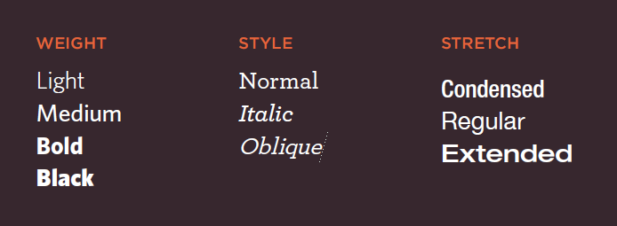

# HTML Images:
* Images add Aesthetic aspect to the website.
* before adding images to your website don't      forget to check the copy rights.
* Images should...[Qouted from Html-Css book page 97]:    
    * be relevant
    * Convey information
    * Convey the right mood
    * Be instantly recognisable
    * Fit the color palette

* best practice is to add a file for all website images.

### Images Formats:
    - JPEG:
    > use :mages that contain a natural scene and Whenever there is many different colors in a picture.
    - PNG:
    > use: image that needs transparency or for images with text & objects with sharp ,large
     areas of the same color.contrast edges 
    - GIF:
    > use: mages that contain animations, least favourable format.
- compression: PNG is the best with compresion; has high quality but accupy more space in the desk. 
- transparancy: Png also is the most favourable format when it comes to transparancy.
- color: 
    - JEPG; support 16 milion colors.
    - Png; hass 2 modes: PNG8:supports 256 colors PNG24: supports 16 milion colors.
    - GIF; supports 256 colors.
### img html element:
``````
attributes :
- src: scource of the image.
- alt:desctibes the image if you can't see it.
- title: image title.
- hight: image hight.
- width : image width.

### where to place your image :
- before a paragraph
- inside the start of a paragraph
- in the middle of a paragraph

### image creating roles:
- *Save images in the right format: jpeg, gif, or png formats.*
- *Save images at the right size: save the image atthe same width and height it will appear on the website.*
- *Use the correct resolution: image resolution should not exceed 72 pixels per inch.*
- you can edit the image: size, format.. ; using ohotos editing softwares like photoshop.
- when you crop an image make sure to crop the correct shape as much as possiple.
- Vector Images: images you can increase its size without affecting its quality.
- examining images on the web: right click and open the image on new window or seelct image information.

### figure and figure caption:
 figure:it can be used to contain any content that is refrenced from the main flow of an article;ex:img,videos..
 figure caption: it is included inside figure tag,which provides a text description for the figure element.

 code example :
 ``` 
 <figure>

<figcaption>
This recipe for individual chocolate
cakes .
</figcaption>
</figure> 
```


# CSS Color:
### we can define a color for html elements by:
1. rgb values: colors in terms of how much red, green and blue are used to make it up.
2. rgba values:colors in terms of how much red, green and blue are used to make it up, in addition to the opacity value (alpha).
3. hex codes:six-digit codes that represent the amount of red, green and blue in a color.
4. hsl& hsla: hue,saturation, lightness, opacity (alpha value 0-1);
5. color names: the browser has the ability to recognize 147 different colors.
### when we choose a color we care about :
- HUE : the stregnth of color (color it self).
- saturation : the amount of gray color.0 sat:0 amount of gray.
- Brightness: how much black in the color. 100 brightness, 0 amount of black color.
- contrast : represent the amount of differance between text color and background color ( how clearly or easly you can read the text).
- lightness: the differance between lightness and brightness is that lightness is the amount of white  or black in a color.

> Examples on defining colors in Css:
```
 background-color: rgb(238,62,128);
 background-color: #ffffff;
 background-color: hsla(0,100%,100%,0.5);
 background-color: #64645A; 
 background-color: blak;
 ```

# CSS Text:
### css text properties:
- font-Weight, font-style, stretch

- font-family
    - Serif
    - Sans-Serif
    - Monospace
    - Cursive
    - Fantasy
- font-size
    - pixels
    - percentages:size reletive to the default size of the browser.
    - Ems: size relative to the paren element.
- font-face: allows you to use a font, even if it is not installed on the computer of the person browsing,
    - font-family
    - src: scource
    - font-format:
        1. eot
        2. woff
        3. ttf/otf
        4. svg
- text-transform:
    - uppercase
    - lowercase
    - capitalize
    - syntax: 
    ``` 
    selector(element) {
    text-transform: uppercase;
    }
    ```
- text-decoration
    1. none
    2. underline
    3. overline
    4. line-through
    5. blink
-  letter-spacing, word-spacing
- text-align: 
    - right
    -left
    -center
    - vertical align:baseline,sub, super, top,text-top, middle, bottom, text-bottom.
    - justify
- text-indent


