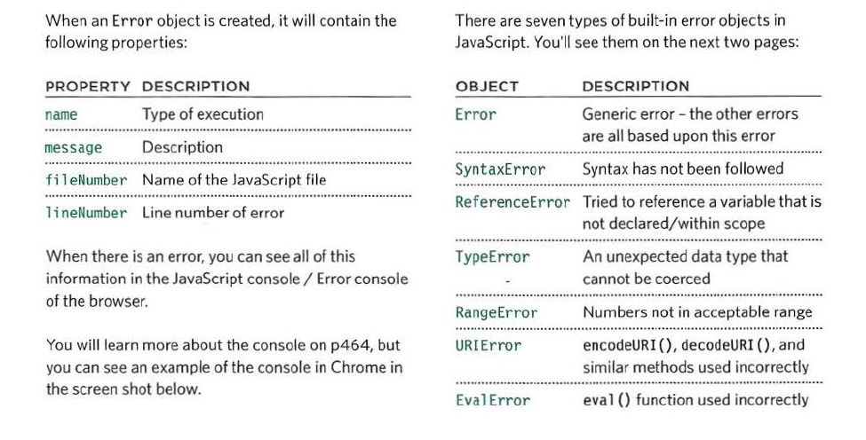

# JS errors:
we need to analyse the problem trace steps and it would be helpfull to know the order of execution.
## order of execution:
The order in which statements are executed can be complex; some tasks
cannot complete until another statement or function has been run,so it is not a stright way here in JS .
## Execution Context:
- GLOBAL CONTEXT.
- FUNCTION CONTEXT.
- EVAL CONTEXT.
 
 ##  Variables Scope:
 - GLOBAL SCOPE.
 - FUNCTION-LEVEL SCOPE.

 JS enterpritter processes one line of code at a time.and when statement needs task from another functiion for example it stack the other function in front of the previos one.

 ## sphases of activity execution:
 - PREPARE:
    - The new scope is created
   - Variables, functions, and arguments are created
    - The value of the this keyword is determined
 - EXECUTE:
    - Now it can assign values to variables
    - Reference functions and run their code
    - Execute statements

- In the interpreter, each execution context has its own va ri ables object. It holds the variables, functions, and parameters available within it. Each execution context can also access its parent's v a ri ables object.
 - Functions have lexical scope: They are linked to the object they were defined within.
 - If a JavaScript statement generates an error, then it throws an exception. At that point, the interpreter stops and looks for exception-handling code.

 ## Error Object:
 

 ## HOW TO DEAL WITH ERRORS:
 - DEBUG THE SCRIPT TO FIX ERRORS.
 - HANDLE ERRORS GRACEFULLY.
 ## Depuging:
 eliminating potential causes of an error.
 - WHERE IS THE PROBLEM?
    - Look at the error message
    - Check how far the script is running
    - Use breakpoints where things are going wrong
- WHAT EXACTLY IS THE PROBLEM?
    - When you have set breakpoints, you can see if the variables around them have the values you would expect them to.
    - Break down I break out parts of the code to test smaller pieces of the functionality.
    - Check the number of parameters for a function, or the number of items in an array.

#### * The JavaScript console is just one of severa developer tools that are found in all modern browsers.
#### * The console will show you when there is an error in your JavaScript. It also displays the line where it became a problem for the interpreter.
### some console method:
1. conso1e. info() can be used for general information
2. consol e.warn() can be used for warnings
3. console .er ror () can be used to hold errors
