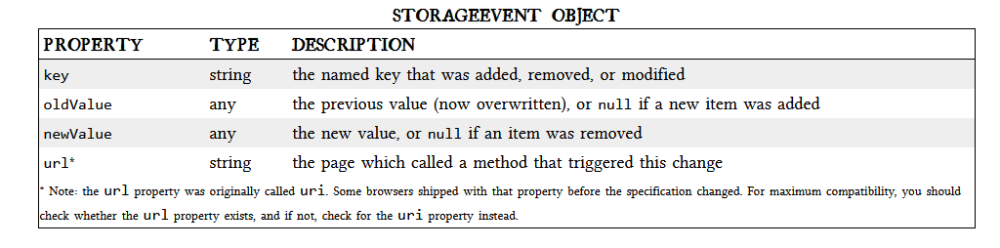

# Local Storage:
## History:
- userData: allows web pages to store up to 64 KB of data per domain.
- Local Shared Objects:it allows Flash objects to store up to 100 KB of data per domain.
- Google launched Gears: After obtaining permission from the user once, Gears can store unlimited amounts of data per domain in SQL database tables. 
## “DOM Storag or HTML5 Storage or Local Storage:
 - it’s a way for web pages to store named key/value pairs locally, within the client web browser. Like cookies.
 - this data is never transmitted to the remote web server.
 check for HTML Storage in your Browser.
 ``` 
 function supports_html5_storage() {
  try {
    return 'localStorage' in window && window['localStorage'] !== null;
  } catch (e) {
    return false;
  }
}
```
- you can treat the localStorage object as an associative array.
- so Local Storage consists of ` Key:Value ` pairs.
## Tracking Changes:
- the storage event is fired on the window object whenever setItem(), removeItem(), or clear() is called and actually changes something. 
- The storage event is supported everywhere the localStorage object is supported.
- 

## Html Sorage limitations:
- 5 megabytes” is how much storage space each origin gets by default;f you’re storing a lot of integers or floats, the difference in representation can really add up.
- NO “QUOTA_EXCEEDED_ERR” is the exception that will get thrown if you exceed your storage quota of 5 megabytes.